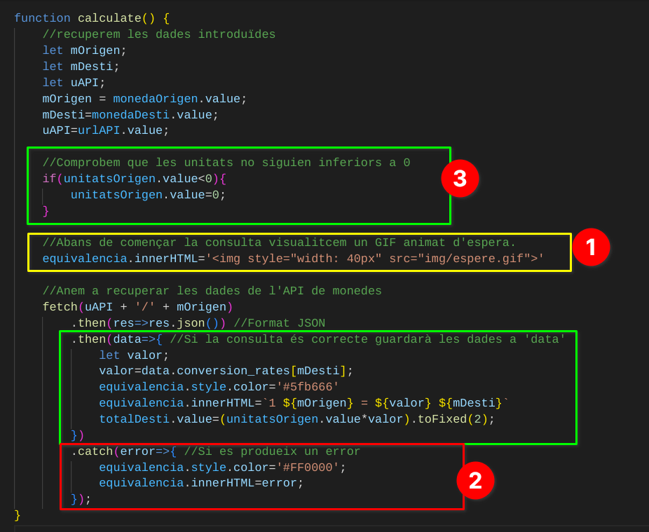

# Conversor de monedas
Hacer uso de código JavaScript para llamar a una API de terceros. Esta Api nos servirá para que facilitándole una moneda base, nos devuelva el cambio al que cotiza esa moneda base respecto a otras muchas.

## 1. Cuando se realiza la consulta al API, indicar estado de espera mediante logo o mensaje por pantalla.
## 2. Si se produce un error al hacer la consulta al API mostrar un mensaje con el error.
## 3. No permitir números negativos.

