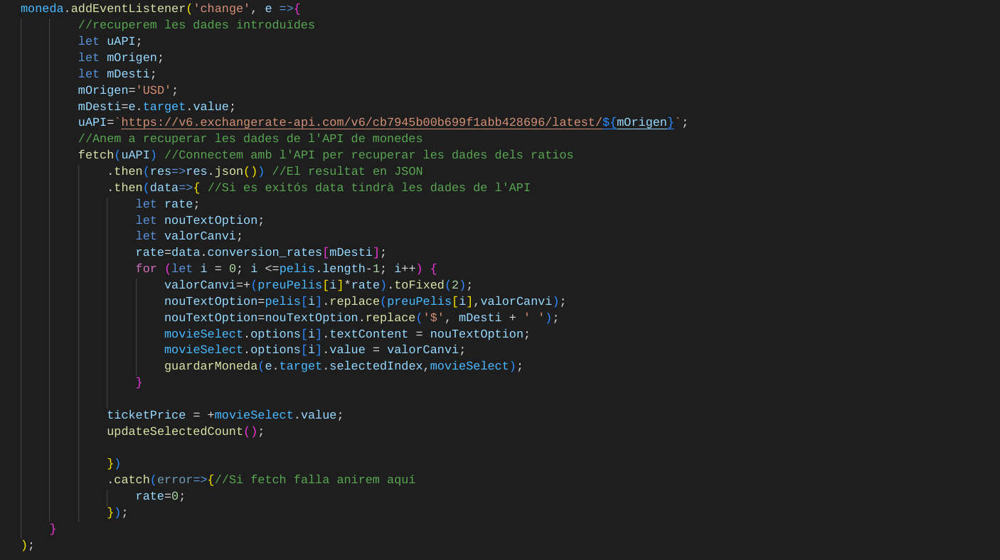
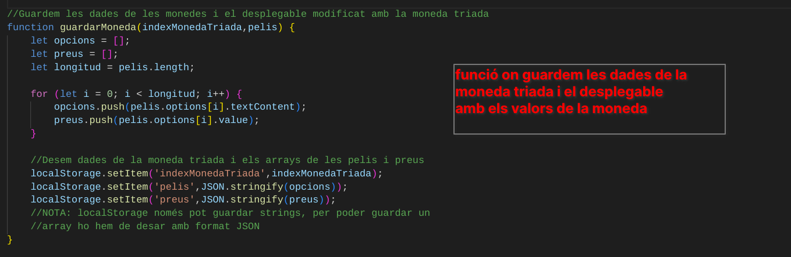
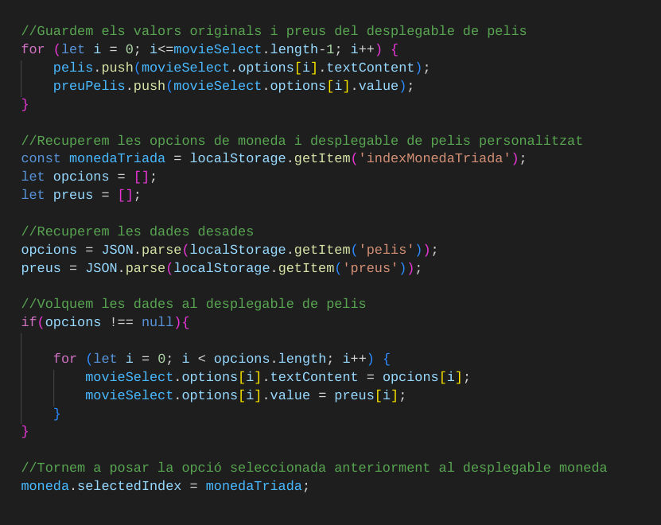

# Entradas de cine
* Realiza una pequeña aplicación para la reserva de asientos de películas, se utilizará almacenamiento local del navegador (es similar a utilizar un fichero de texto, pero almacenado en el navegador).
* Integra esta parte con la Calculadora de tipos de cambio de moneda de forma que la aplicación realizada para reserva de asientos de cine permita seleccionar la moneda en la que trabajara la aplicación y se ofrezcan tanto los precios de las películas, como los precios finales en la moneda seleccionada.

## Evento para el canvio de moneda

## Guardar configuración moneda y desplegable películas

## Recuperar configuración moneda y desplegable películas

