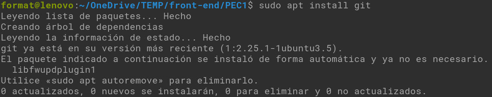
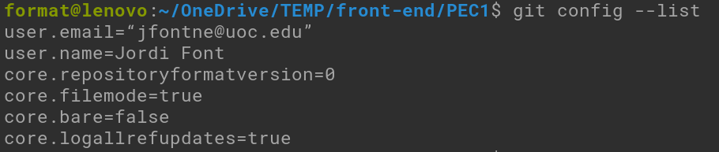

# PEC1 Exercici 1
## Dades Alumne
* jfontne@uoc.edu
* Jordi Font Nebot

## Descripció pràctica
* La instal·lació de git des de Linux ha estat molt fàcil,en aquest cas estic utilitzant Elementary OS que està basada en Ubuntu a l'igual que una altre distribució que utilitzo molt habitualment que és Linux Mint, per fer-ho utilitzarem el terminal i amb la següent instrucció:
  ~~~
  sudo apt install git
  ~~~
  

* Una vegada instal·lat utilitzarem les següets comandes per configurar dades generals del nostre git
  ~~~
  git config --global user.name "Jordi Font"
  git config --global user.email “jfontne@uoc.edu”
  ~~~
  Aquí veiem el resultat
  
  
  

